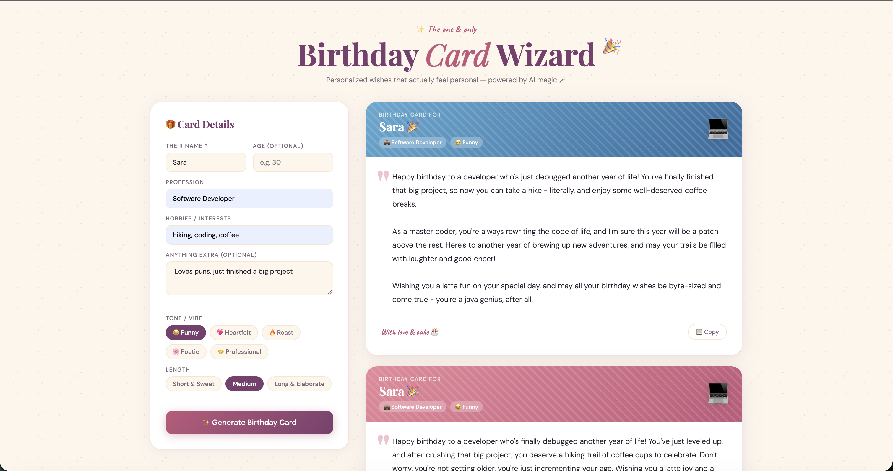

# 🎂 Birthday Card Wizard

An AI-powered web application that generates unique and personalized birthday card messages. It leverages the Groq API to create custom greetings based on the recipient's details, tone preferences, and desired message length.

## Features

- **Personalized Messages:** Generate birthday wishes tailored to the recipient's name, age, profession, hobbies, and any extra context provided.
- **Customizable Tone:** Choose from various tones like Funny, Heartfelt, Roast, Poetic, or Professional to match the occasion.
- **Adjustable Length:** Select between Short & Sweet, Medium, or Long & Elaborate messages.
- **Dynamic Emojis & Themes:** Cards are displayed with relevant emojis and attractive, rotating themes.
- **Easy Copy Functionality:** Quickly copy the generated message to your clipboard.
- **Responsive Design:** A clean and intuitive user interface that works well on different screen sizes.

## Screenshots



## Project Structure

```
birthday-card-wizard/
├── index.html        ← Frontend
├── api/
│   └── generate.js   ← Vercel serverless function (keeps API key secret)
├── vercel.json       ← Vercel config
├── .gitignore        ← Keeps .env out of git
└── README.md
```
